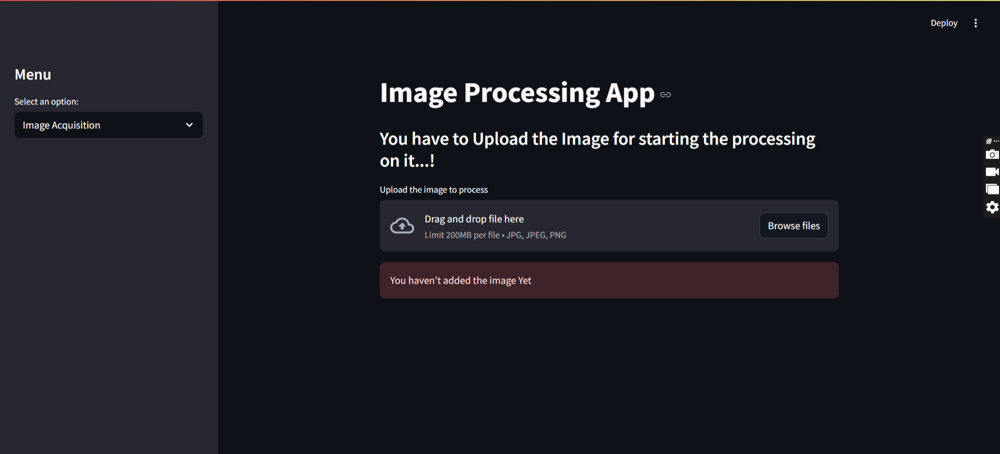

# 🚀 How to Run This Project

## 1. Clone the repository

git clone https://github.com/yourusername/your-repo-name.git

cd your-repo-name

## 2. Set up a virtual environment (optional but recommended)

python -m venv venv

source venv/bin/activate  # On Windows: venv\Scripts\activate

## 3. Install the required dependencies

Make sure you have Python 3.8+ installed. Then run:

pip install -r requirements.txt

## 1. Run the main code

streamlit run main.py
